# real-time Python web application.

## A detailed guide for creating a real-time Python web application using Flask,and deploying it on an AWS EC2 instance launched from a custom Amazon Machine Image (AMI).

### Project conspectus: Real-Time Python Web Application Using AWS AMI

we will set up a simple Flask application that displays the current server time.

We will create a custom AMI after the setup so that the application can be easily replicated

**we have to do sum Creaction and Configure an EC2 Instance**

2. **Install Required Packages**
3. **Develop the Flask Application**
4. **Run the Application**
5. **Create a Custom AMI**
6. **Cleanup**

## Step-by-Step Task Instructions.

### now we have Configure an EC2 Instance.

**Log in to the AWS Management Console** and navigate to the **EC2** dashboard.
**Launch an Instance:**  - Click on "Launch Instance." - Choose the **Amazon Linux 2 AMI**. - Select an instance type `t2.micro` for the free tier.
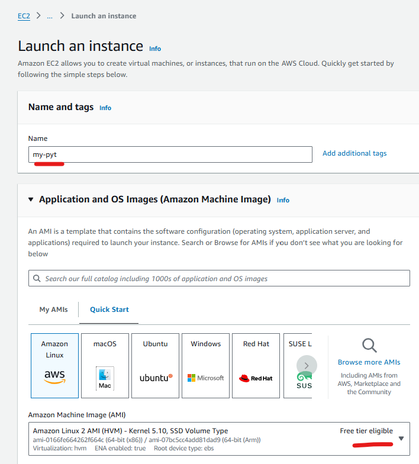
- Click "Next: Configure Instance Details."    **Configure Instance Details:**   - Leave default settings or customize as needed.   - Click "Next: Add Storage."
**Configure Storage:**   - Default settings are usually fine (8 GiB).   - Click "Next: Add Tags."
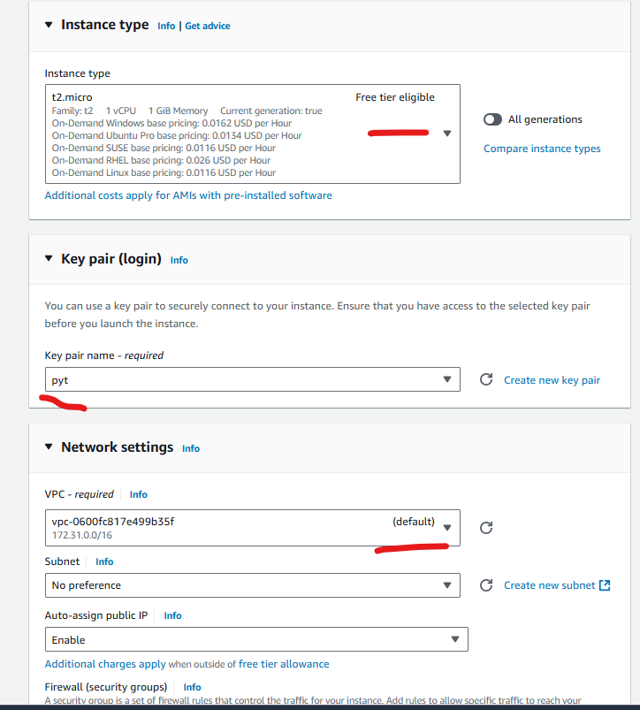
**Add Tags (Optional):**
- Add any tags for organization, Key: `pyt`, Value: `pytInstance`.   - Click "Next: Configure Security Group."   **Configure Security Group:**  - Create a new security group.   - Add the following rules: 

http-80 (web)  
ssh-22  (security),
Custom TCP-5000 (app)
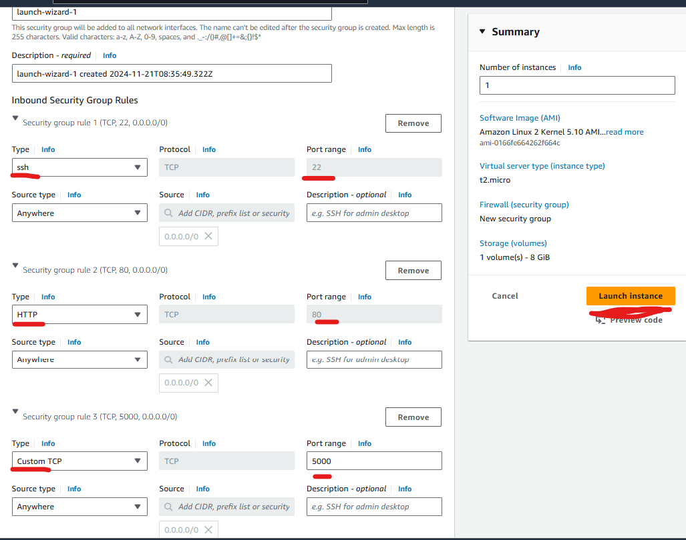
Click "Review and Launch."

Review your configurations and click "Launch." - Choose or create a key pair for **SSH access**, and download it. 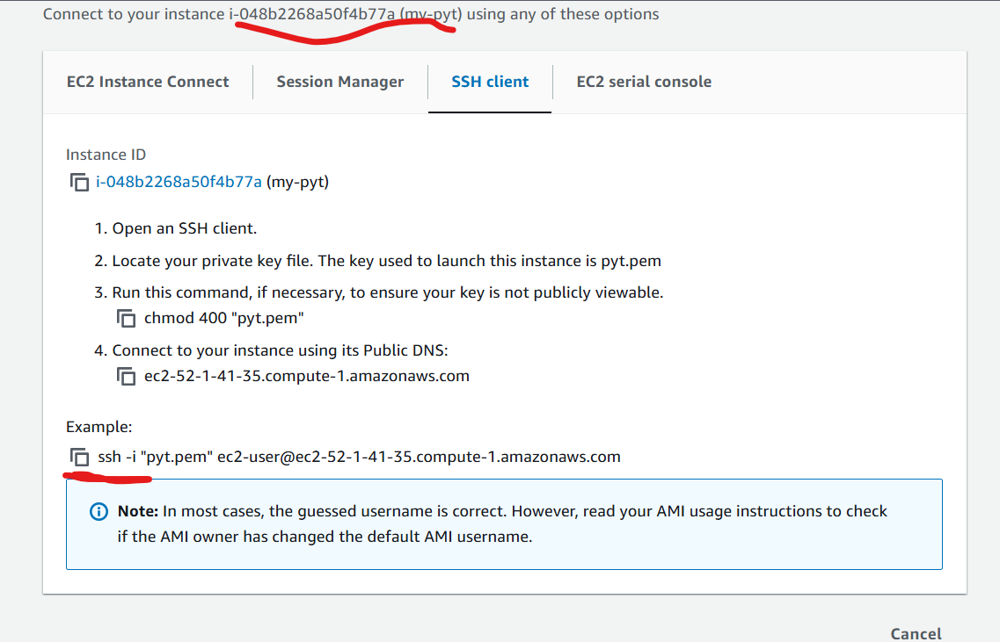

**Connect via SSH:** ssh -i your-key.pem ec2-user@your-public-insteance

Step 3: Install Required Packages

1. **Update the Package Repository:**   sudo yum update -y
   
2. **Install Python 3 and pip:**
  sudo yum install -y python3

3. **Install Flask:**
pip3 install Flask
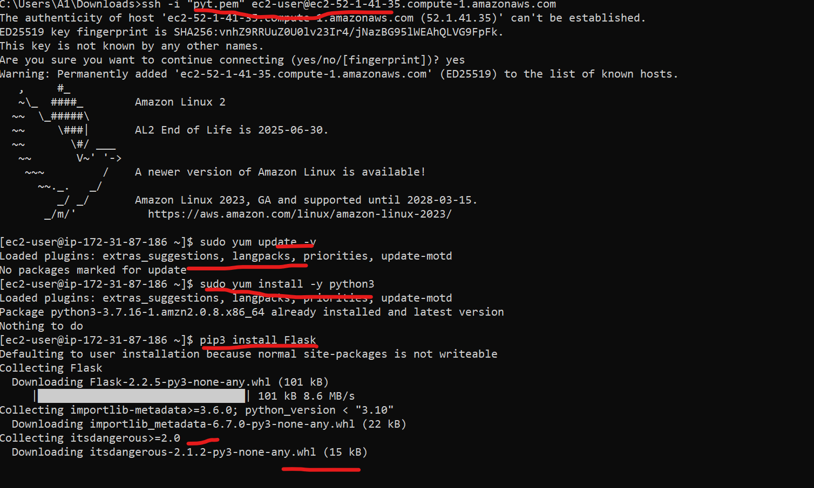

Develop the Flask Application

1. **Create a New Directory for YourApplication:** mkdir flask-app  cd flask-app   2. **Create the Flask App:**   - Create a file named `app.py`: (exp) `vi app.py` (or) `vim app.py`(or) `nano app.py`
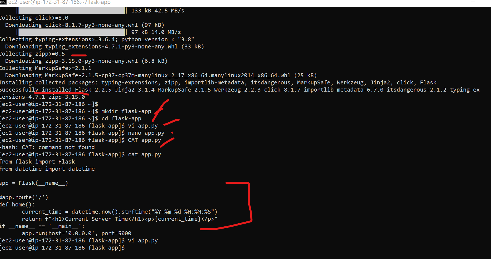

## Run the Application 

1. **Start the Flask Application:**  `python3 app.py`
**Access Your Application:** - Open a web browser and navigate to `http://your-instance-public-dns:5000`.
- You should see the current server time displayed.
.png)

# Create a Custom AMI

**Stop the EC2 Instance:** - Go back to the EC2 console and select your instance.
- Click on "Instance State" and then *Stop*
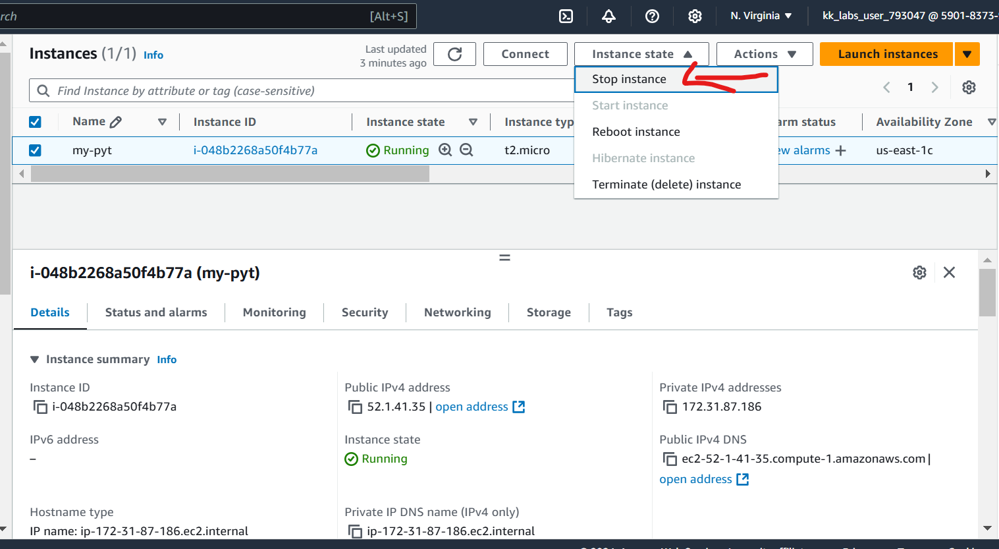

**Create an AMI:**
- Right-click on your stopped instance, select "Image," and then "Create Image."
- Name it ( `FlaskAppAMI`), and fill in any details.
- Click "Create Image."
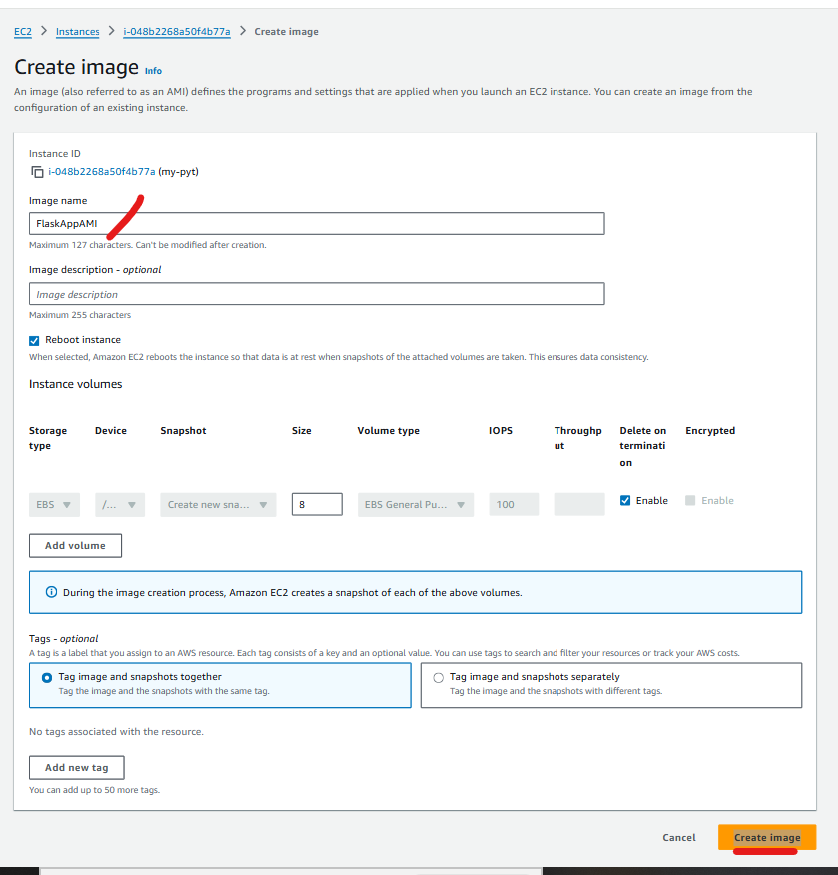
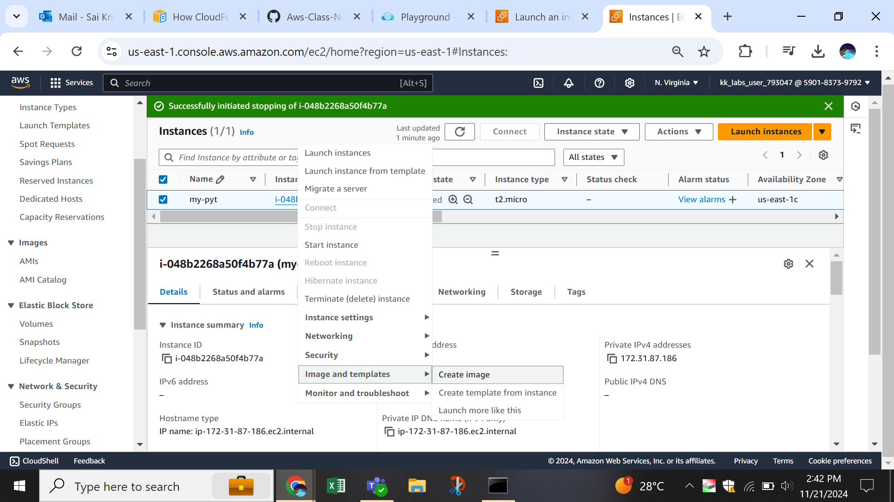

**Launch New Instances from Your AMI:**
You can now launch new EC2 instances using this custom AMI, which includes your pre-configured Flask application 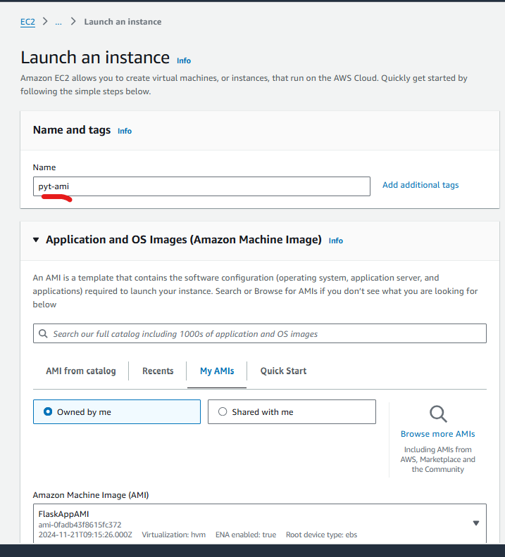          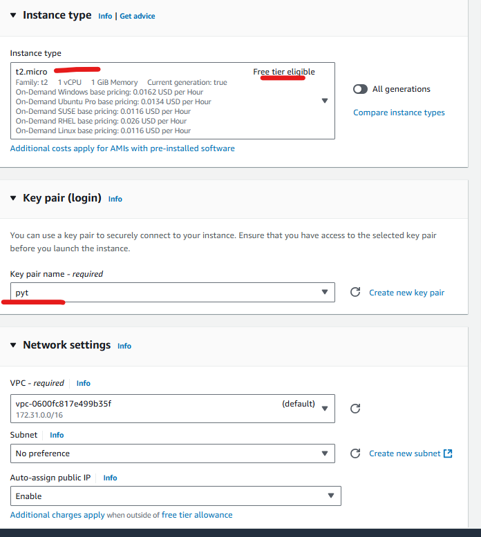
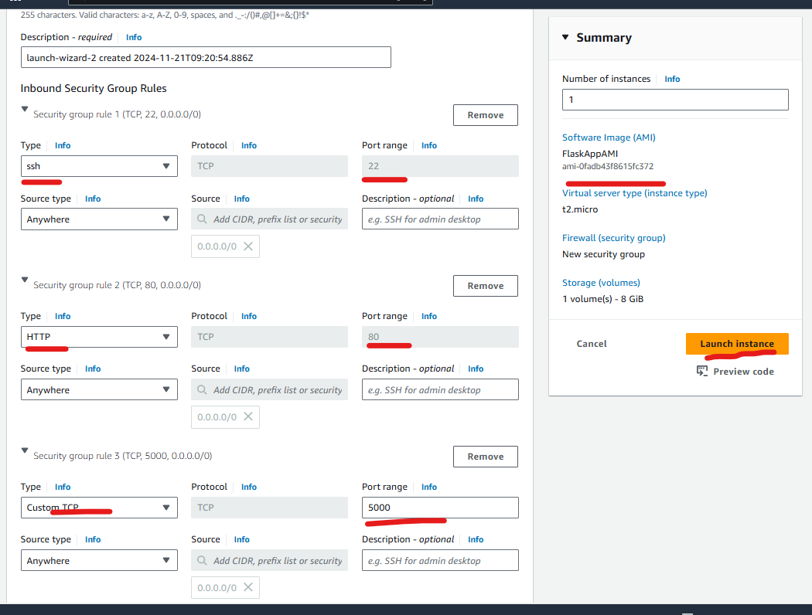
launch an ami insteance

Review your configurations and click "Launch." - Choose or create a key pair for **SSH access** of ami insteance.
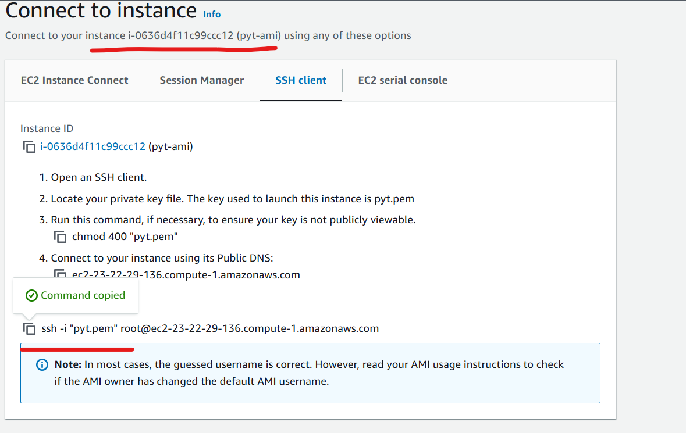

next do this steps
- ls
- cd flask.app
- python3 app.py
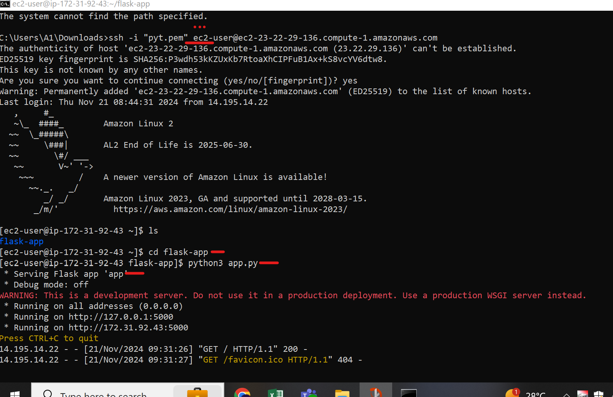

copy ami public ip adderess ec2-user@your-public-insteance & past in url (exp) 23.22.29.136:5000
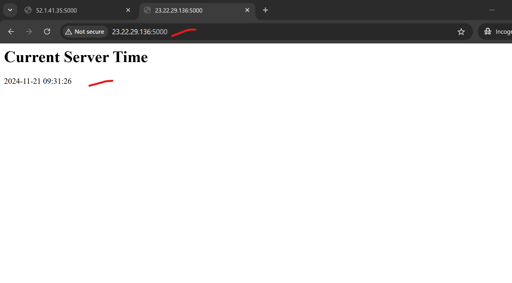

**Terminate the EC2 Instance:**  After verifying everything, make sure to terminate your instance to avoid charges.

Conclusion

**You've successfully created a real-time Python web application using Flask on an EC2 instance,and you learned how to create a custom AMI to replicate this setup easily.**

