#  real-time application using AWS EC2 with an Elastic File System 

## volume allows multiple instances to share a common file system,making it ideal for scenarios like real-time data processing, content management, or collaborative applications

# Application Using AWS EC2 with EFS

**Access the AWS Management Console Log in to your AWS Management Console Navigate to the Amazon EFS service by searching for "EFS" in the search bar.**

**Navigate to the Amazon EFS service by searching for "EFS" in the search bar.and create an EFS system.** 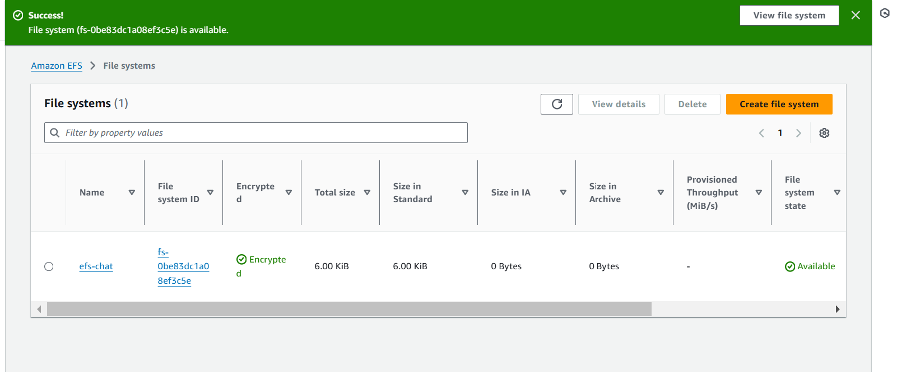.

**now we have to launch an insteance. Before launching we hance to create a security group gave port "2049" next launch ssh,port 3000** **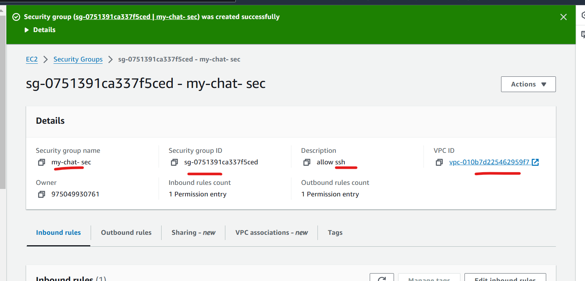 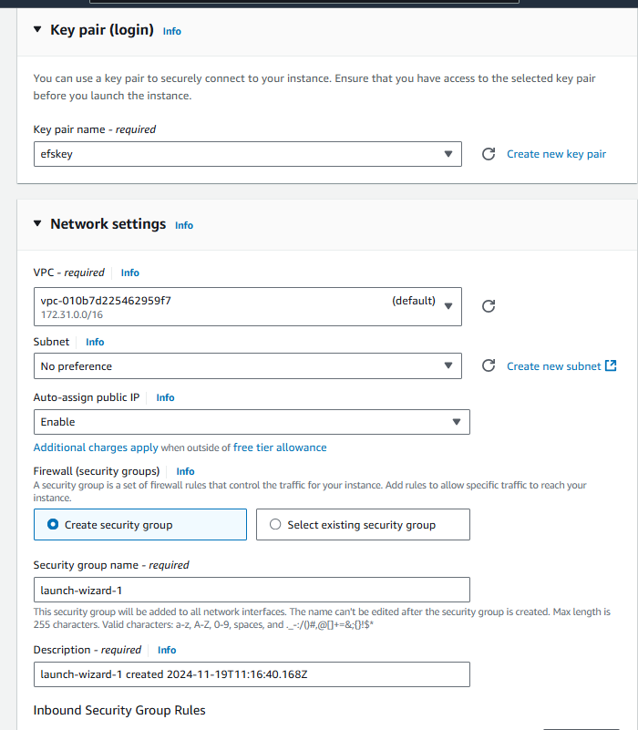 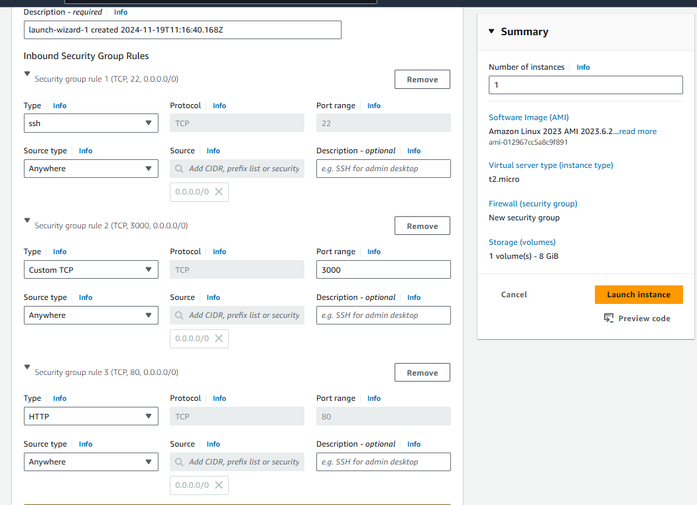**

**go to insteance connect the insteance with ssh in commandpromt** 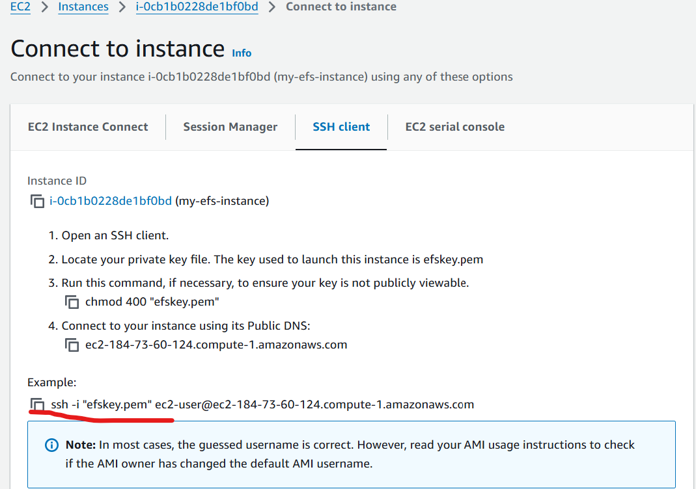

**opean commandpromt past ssh key clone in that** 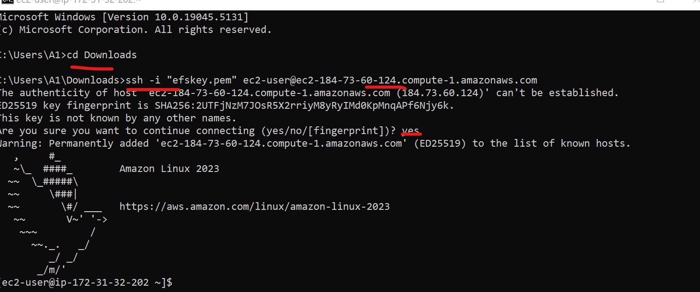

## Mount EFS on the EC2 Instances.
**Install the EFS ```sudo yum install -y amazon-efs-utils```** 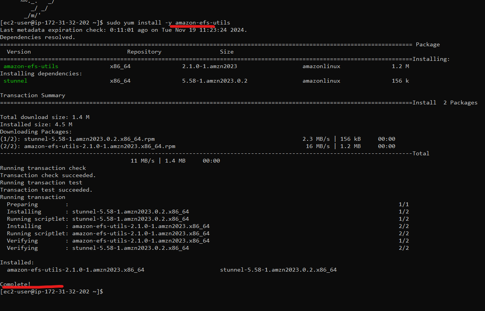 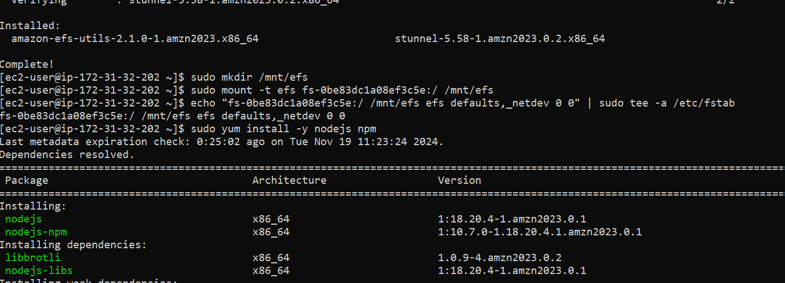

**Create a Mount Point ```sudo mkdir /mnt/efs```**

**Mount the EFS File System ```sudo mount -t efs fs-0be83dcla8ef3c5e:/ /mnt/efs```**

**Ensure EFS is Mounted on Reboot ```echo "fs-0be83dcla8:/ /mnt/efs efs defaults,_netdev 0 0" | sudo tee -a /etc/fstab```**

**Set Up the Node.js Application Install Node.js and NPM ```sudo yum install -y nodejs npm```**
**Create a New Directory for Your Project ```mkdir /mnt/efs/chat-app```. ```cd /mnt/efs/chat-app```**

**Initialize a New Node.js Project ```npm init -y```** 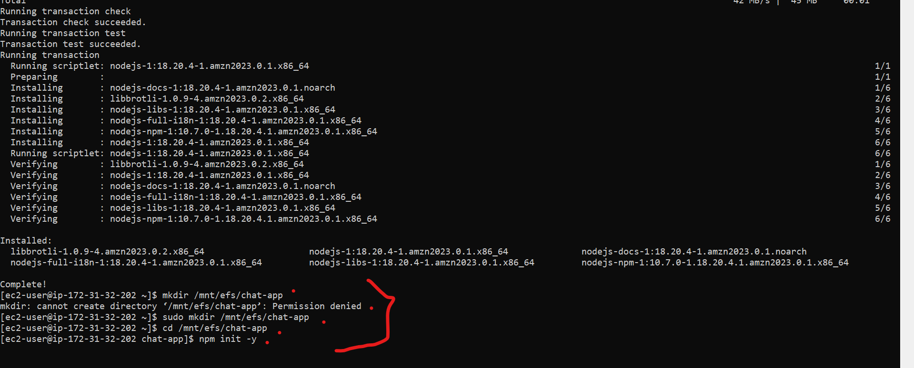 **we dident initialize the node.js. we do sum trouble shoot. we gave some comands**```sudo chmod -R 775 /mnt/efs/chat-app```
```sudo chown -R ec2-user:ec2-user /mnt/efs/chat-app```
```sudo chown -R ec2-user:ec2-user ~/.npm```
```npm install --unsafe-perm=true```
```sudo npm install```
```npm cache clean --force```
```sudo yum remove nodejs```
```sudo yum install -y nodejs```
.png) **now we are insitialize node.js**

**Install Required Packages ```npm install express ws body-parser```**

**now we have to create a file named `server.js ```vi server.js``` past the code**.png)

#Create a Simple HTML Client
**Create a directory named `public`, and inside it create an `index.html` file: ```vi index.html```**.png)

**Run Your Application before that ``mkdir public`` ``mv index.html public/``  ```node server.js```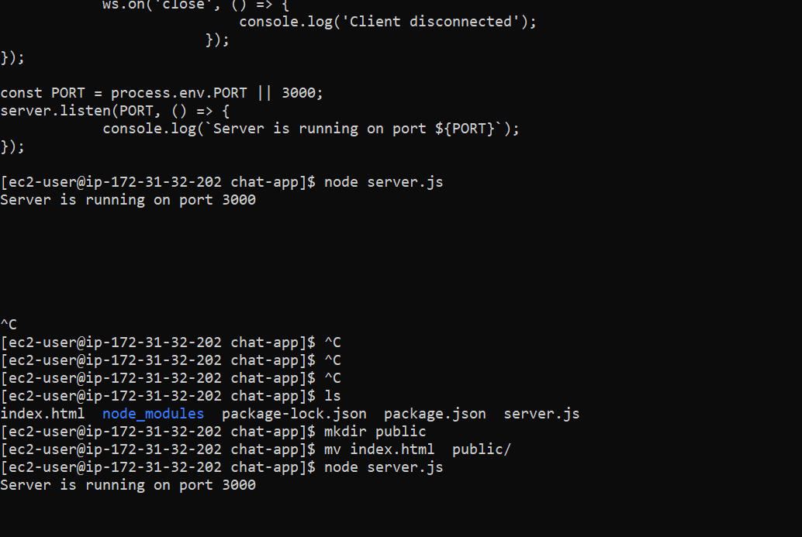** **now server is running on port 3000**

**now copy public ip address in url 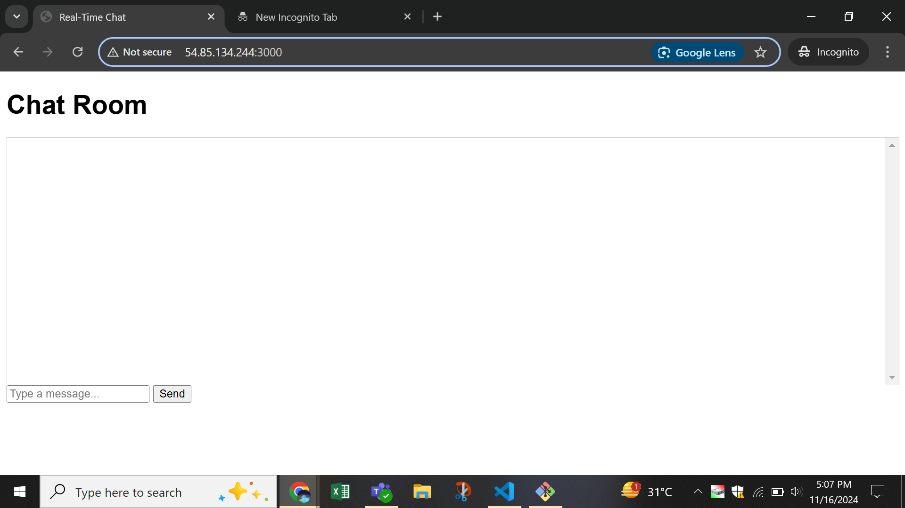** 

**You have successfully created a real-time chat application using AWS EC2 with EFS for storage! This setup allows multiple EC2 instances to access shared data in real-time.**