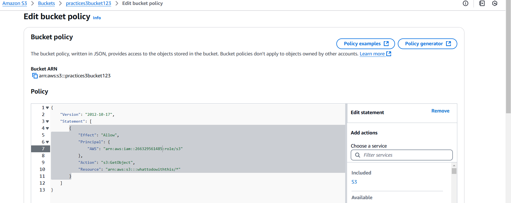

# Real-World scenario 

## task scenario Imagine a scenario where a media company needs to store high-resolution images and video content. The images/ folder is used for frequently accessed images, while videos/ are archived after a certain period. Content must be stored securely, with only authorized users able to access and manage files, while older files are automatically archived for cost efficiency.

## Task summary :what we can do in task
**Participants will create an S3-based solution to store, organize, manage, and archive multimedia content (e.g., images, videos, documents). They’ll learn to set up bucket configurations, use object versioning, implement lifecycle policies, and enforce security through bucket policies and access controls.**

### plan.
**•	Gain practical experience with S3 bucket creation, object storage, versioning, and lifecycle policies.**

**•	Learn to secure data using bucket policies, encryption, and access control lists (ACLs).**

**•	Understand cost optimization through storage class transitions and lifecycle management.**

**•	Use S3 event notifications to simulate file management automation**

### Step-by-Step Task implementation.

**1.	Create an S3 Bucket with Appropriate Naming and Versioning**
o	Create a new S3 bucket named multimedia-storage-[aja-s3-bk]-bucket.

o	Enable bucket versioning to manage file versions and track changes over time.

o	Upload a few files with the same name multiple times to test versioning. Observe how S3 maintains versions of each object.
  create abucket.

### 2.	Organize Files Using Prefixes (Folders).
my (example) Prefixes can be used to organize objects in various storage systems, including Amazon Simple Storage Service.

o	Create a folder structure within the bucket. For instance:
* images/
* videos/	
* documents/

o	Upload several files into each "folder" and understand how prefixes work in S3 to simulate directory structures.  
 uploading a images in folder & upload
uploading a documents in the folder & upload.
 uploading a vidoes in folder & upload.
**now we are Organize Files Using Folders in s3 bucket.** 

# 3.	Implement Lifecycle Policies for Cost Optimization
now Set up lifecycle policies for **each folder** to move objects to **cost-effective storage classes** over time: 

	Move objects in the **images**/ folder to S3 Standard-IA (Infrequent Access) after 30 days.
 

	Move objects in the **videos**/ folder to S3 Glacier after 60 days and delete them after 180 days.

	Experiment with different configurations for archiving data based on folder and file type.

1. Transition to Infrequent Access (IA)
Policy: After X days of object creation (e.g., 30 days), move data from the Standard storage class to Standard-IA or One Zone-IA.

1. Transition to Infrequent Access (IA)
Policy: After 29 days of object creation (e.g. 30 days), move data from the Standard storage class to Standard-IA or One Zone-IA.

Access Pattern: Objects are frequently accessed initially but are rarely accessed after some time.
Cost: Standard-IA or One Zone-IA has lower storage costs compared to Standard, though retrieval costs are higher. This balances cost and occasional retrieval needs.
Use Case: Logs, reports, or backup data that are reviewed less frequently after creation.

2. Transition to Glacier/Deep Archive
Policy: Move objects to Glacier Flexible Retrieval or Glacier Deep Archive after 90 or 180 days, based on access needs.

# Enable Server-Side Encryption
o	Apply server-side encryption to the bucket to secure data at rest.

o	Use S3 managed keys (SSE-S3) or AWS KMS keys (SSE-KMS).   

o	Document the steps taken to enable encryption and the differences between SSE-S3 and SSE-KMS

# Configure Access Controls and Bucket Policies
Create a bucket policy that grants read access to a specific IAM role or user.

Add an Access Control List (ACL) to give specific permissions to selected users or groups.

Ensure that public access is blocked (unless specified) to prevent unintended exposure.

o	Review the policy and understand how permissions are defined and restricted.

# Set Up S3 Event Notifications for File Management Automation
o	Configure the bucket to send event notifications on specific events, such as s3:ObjectCreated:* or s3:ObjectRemoved

o	Route notifications to an Amazon SNS topic or email to simulate automation for file management.
o	Upload and delete files in the bucket, observing notifications for each action.

# Implement Cross-Region Replication (Optional)
o	Set up Cross-Region Replication (CRR) to duplicate data from your primary bucket to a secondary bucket in another AWS region.
o	Make sure versioning is enabled on both buckets and create IAM policies that permit replication.
o	Test the replication by uploading files to the primary bucket and verifying their presence in the secondary bucket.

