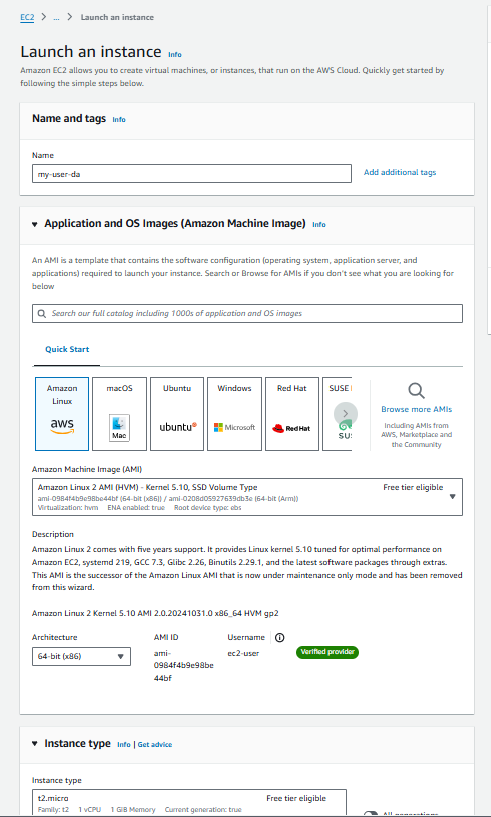
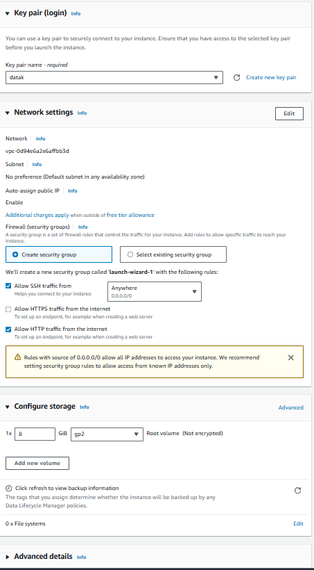
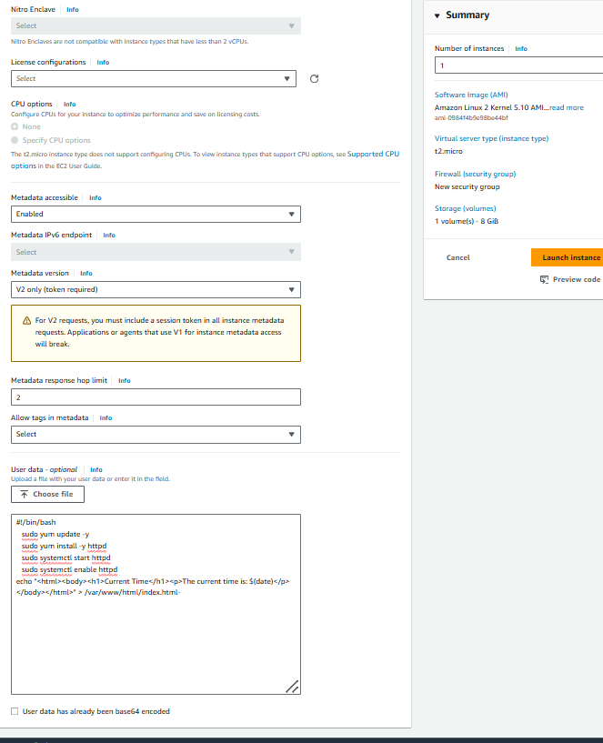
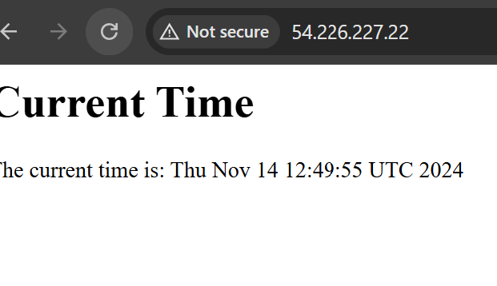

# Project Overview: Real-Time Web Application with User Data

### In this project, we will launch an EC2 instance that automatically installs and configures a simple web applicationusing a User Data script. This application will serve a webpage that displays real-time data, such as the current time.

**Step 1: Create an EC2 Instance with User Data**

**Log in to the AWS Management Console and navigate to the EC2 dashboard**

**Click on "Launch Instance."Choose an Amazon Machine Image(AMI), such as Amazon Linux 2.Select an instance type t2.micro for the free tier.In the "Configure Instance" steps  **

**before launch instance go to advanced details add the User Data  then launch instance** 
3. **Add User Data Script:**

**In the User Data field, enter the following script**
  **#!/bin/bash**
   **yum update -y**
   **yum install -y httpd**
   **systemctl start httpd**
   **systemctl enable httpd**
   **Create a simple HTML page that displays the current time**
   **echo "<html><body><h1>Current Time</h1><p>The current time is: $(date)</p></body></html>" > /var/www/html/index.html**
   
**go to EC2 dashboard opean instance id    i-09db521b3f8fe20a8 and copi public ip address and past in url (54.226.227.22)**

# note.

**Configure Security Group:**
**Allow inbound traffic on port `80` (HTTP) and `22` (SSH)**
 **Access Your Application**

1. **Get the Public IP Address:**
   - **Once the instance is running, note the public IP address from the EC2 dashboard.**

2. **Open a Web Browser:**
 **Navigate to `http://your-instance-public-ip**
**You should see a webpage displaying the current time**

**Verify the User Data Execution**

1. **SSH into Your Instance:**

   ```ssh -i your-key.pem ec2-user@your-instance-public-ip```

2. **Check the Web Server Status:**

   ```sudo systemctl status httpd```

3. **Verify the HTML File:**
   ```bash
   cat /var/www/html/index.html```

**You've successfully created a simple web application that utilizes AWS User Data to automatically** 
**install and configure a web server on EC2 launch. The webpage displays the current time**


