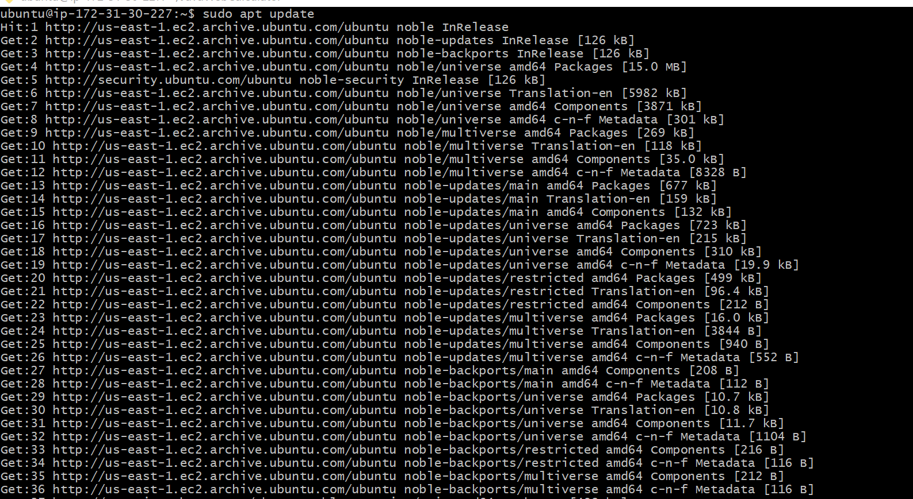
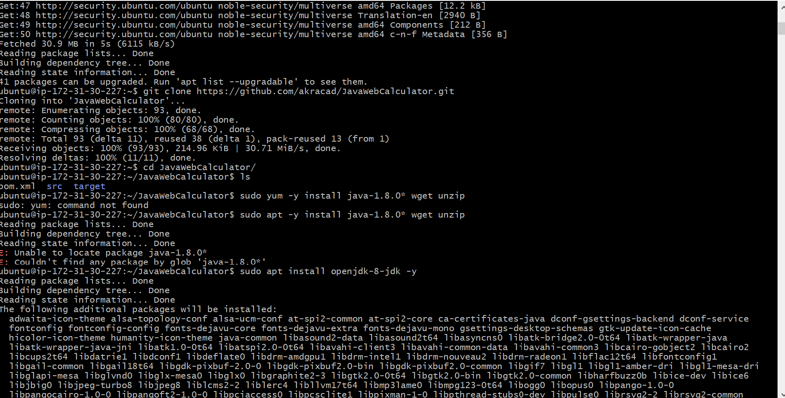
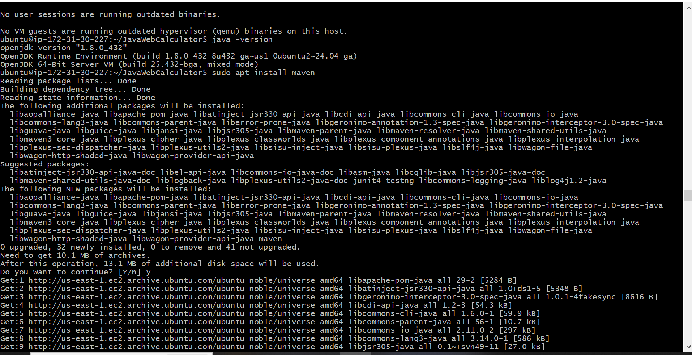
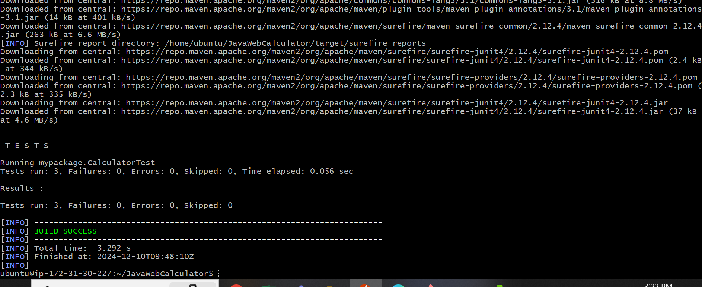
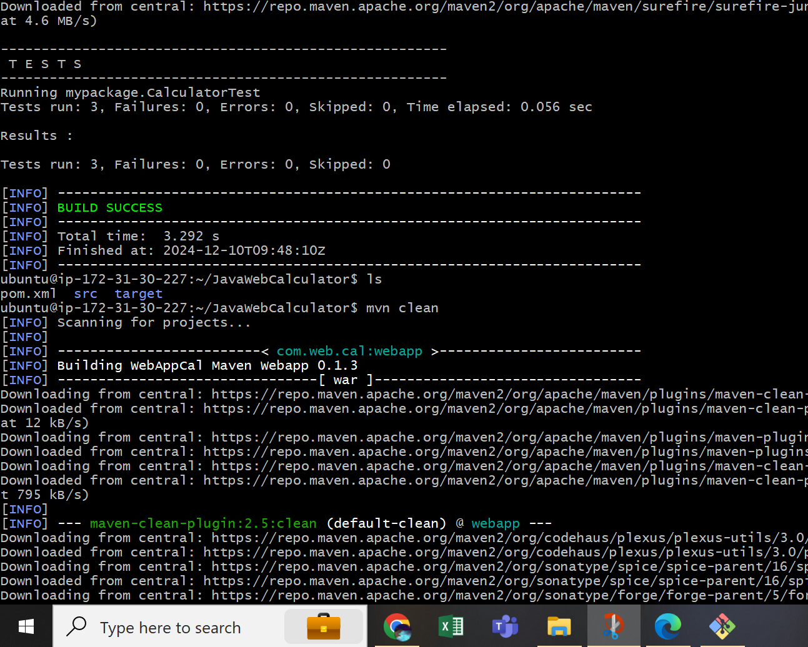
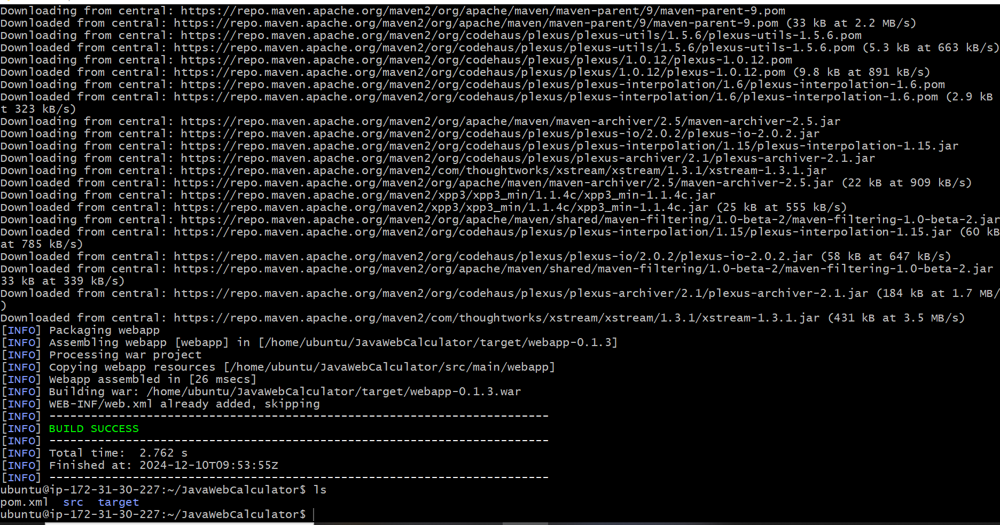
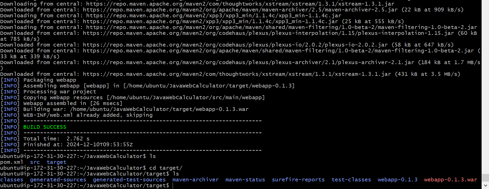

**Installing JBoss (WildFly) on Ubuntu**

PrerequisitesInstall Java Development Kit (JDK)Ensure you have a JDK installed

`sudo apt install default-jdkCreate` a Dedicated User Account
Create a user account to run WildFly:

`sudo groupadd wildfly`
`sudo useradd -r -g wildfly -d /opt/wildfly -s /sbin/nologin wildfly`

Download and Extract WildFly
Download the WildFly .tar.gz file:

`wget https://github.com/wildfly/wildfly/releases/download/34.0.1.Final/wildfly-34.0.1.Final.tar.gz`

Extract the downloaded archive:

`sudo tar -xzvf wildfly-34.0.1.Final.tar.gz -C /opt/`

Set the appropriate permissions:

`sudo chown -R wildfly:wildfly /opt/wildfly-34.0.1.Final`

Configure Systemd ServiceCreate a systemd service file for WildFly:

`sudo nano /etc/systemd/system/wildfly.service`

