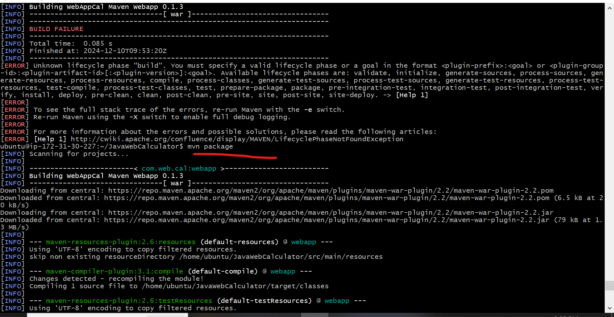
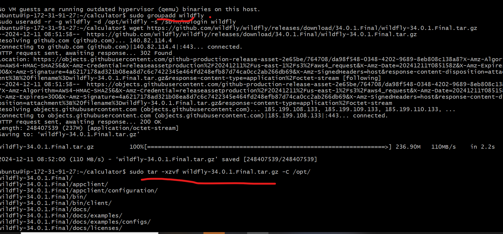

**Installing JBoss (WildFly) on Ubuntu**

PrerequisitesInstall Java Development Kit (JDK)Ensure you have a JDK installed

`sudo apt install default-jdkCreate` a Dedicated User Account
Create a user account to run WildFly:


`sudo groupadd wildfly`
`sudo useradd -r -g wildfly -d /opt/wildfly -s /sbin/nologin wildfly`

Download and Extract WildFly
Download the WildFly .tar.gz file:

`wget https://github.com/wildfly/wildfly/releases/download/34.0.1.Final/wildfly-34.0.1.Final.tar.gz`

Extract the downloaded archive:

`sudo tar -xzvf wildfly-34.0.1.Final.tar.gz -C /opt/`


Set the appropriate permissions:

`sudo chown -R wildfly:wildfly /opt/wildfly-34.0.1.Final`

Configure Systemd ServiceCreate a systemd service file for WildFly:

`sudo vim /etc/systemd/system/wildfly.service`

# WildFly Systemd Service File

```ini
[Unit]
Description=WildFly Application Server
After=network.target

[Service]
User=wildfly
Group=wildfly
WorkingDirectory=/opt/wildfly-34.0.1.Final/bin
ExecStart=/opt/wildfly-34.0.1.Final/bin/standalone.sh -b 0.0.0.0
ExecStop=/opt/wildfly-34.0.1.Final/bin/standalone.sh -S

[Install]
WantedBy=multi-user.target.
```
# To copy the target/*.war file to the JBoss default deployment directory, you can use the following command:#

`sudo cp target/*.war /opt/wildfly-34.0.1.Final/standalone/deployments/`

# Start and Enable WildFly
### Start and enable WildFly:

`sudo systemctl start wildfly`

`sudo systemctl enable wildfly`

# Check the status of WildFly:

`sudo systemctl status wildfly`


# Access the WildFly Management Console
using public ip :8080 


