#  Web Application in AWS VPC

**open your aws console and opean vpc in dash board and create vpc**

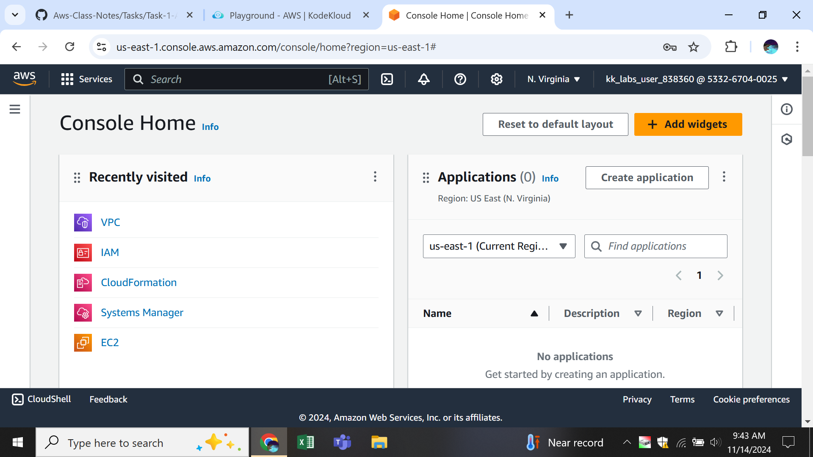
**now click on vpc to create a vpc Choose Create VPC and assign a Name and IP range**

**next create vpc **

**create vpc now  we have to create a rout tables like public, private**

**Navigate to the VPC Dashboard in the AWS Management Console to create apublic subnets 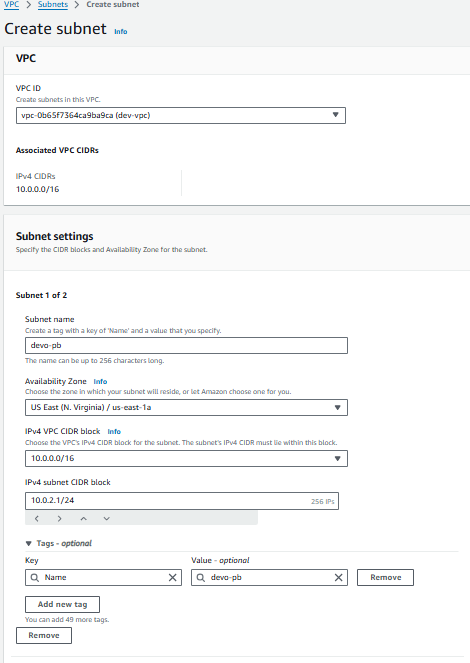 choose an Availability Zone  "us-east-1a" Enter the IPv4 CIDR Block to define the IP range  and For the private subnet, repeat the steps above and create subnets 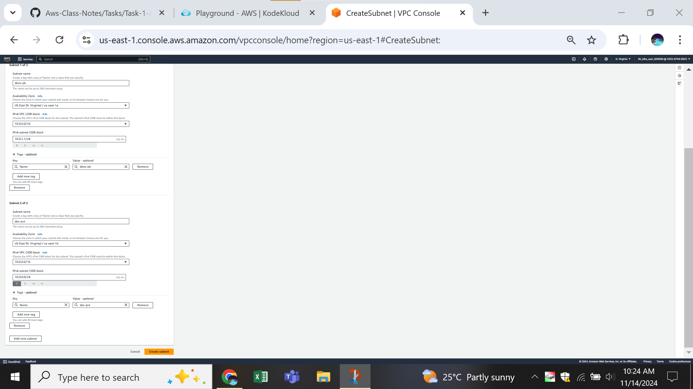**

**now we have to create a route tables Open the VPC Dashboard in the AWS Management Console craete public & private route table Select Route Tables  then click "Create Route Table"**
**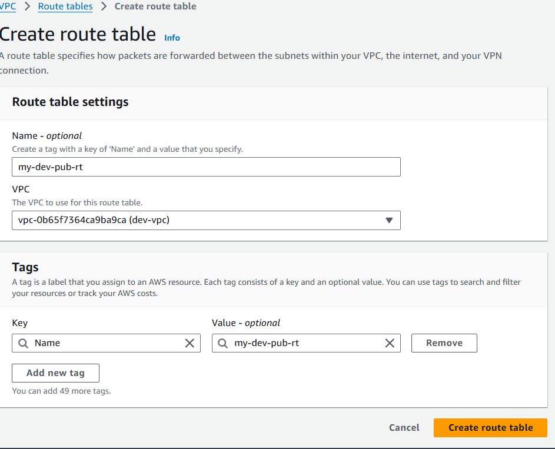 click on create a route table**

**now configured to connect to the internet through an Internet Gateway, onealy public vpc can configured while the private subnet remains isolated for secure resources**

**Go to the VPC Dashboard in the AWS Management Console Select "Internet Gateways" then click "Create Internet Gateway" 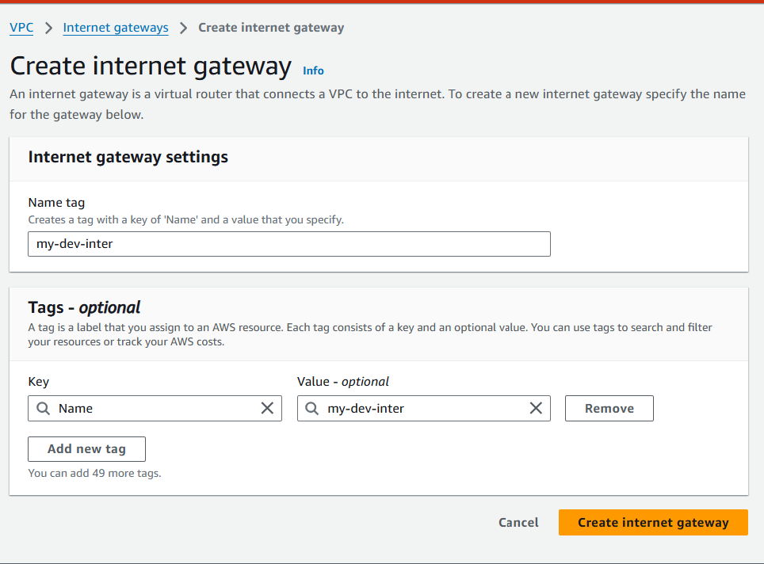 Click "Create Internet Gateway" to finish the creation.**

**To attach the Internet Gateway to your VPC Select the Internet Gateway you  "Actions" and choose "Attach to VPC" from the dropdown menu.Choose your VPc then click "Attach Internet Gateway" to link it to your VPC.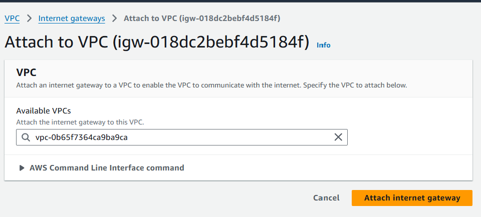**

**Go to inbound rules  and edit inbound rules gave Anyware attach internet gateway (0.0.0.0/0) 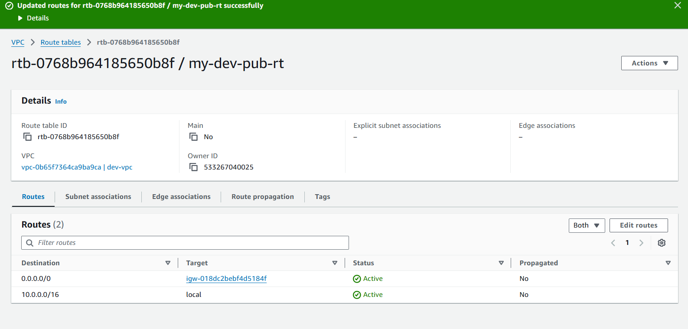**

**Go to edit subnet association  and edit subnet association  gave take public subnet and save subnet association 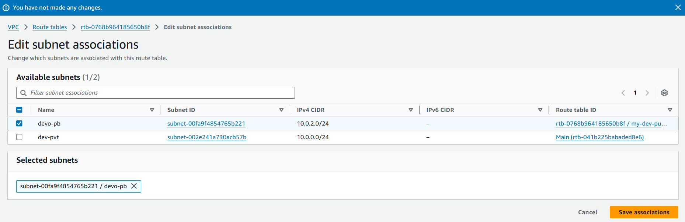**

**To create a Network ACL (NACL) in AWS Open the VPC Dashboard Select "Network ACLs"** **then click "Create Network ACL"** **Enter a name for the Network nacl to vpc**
**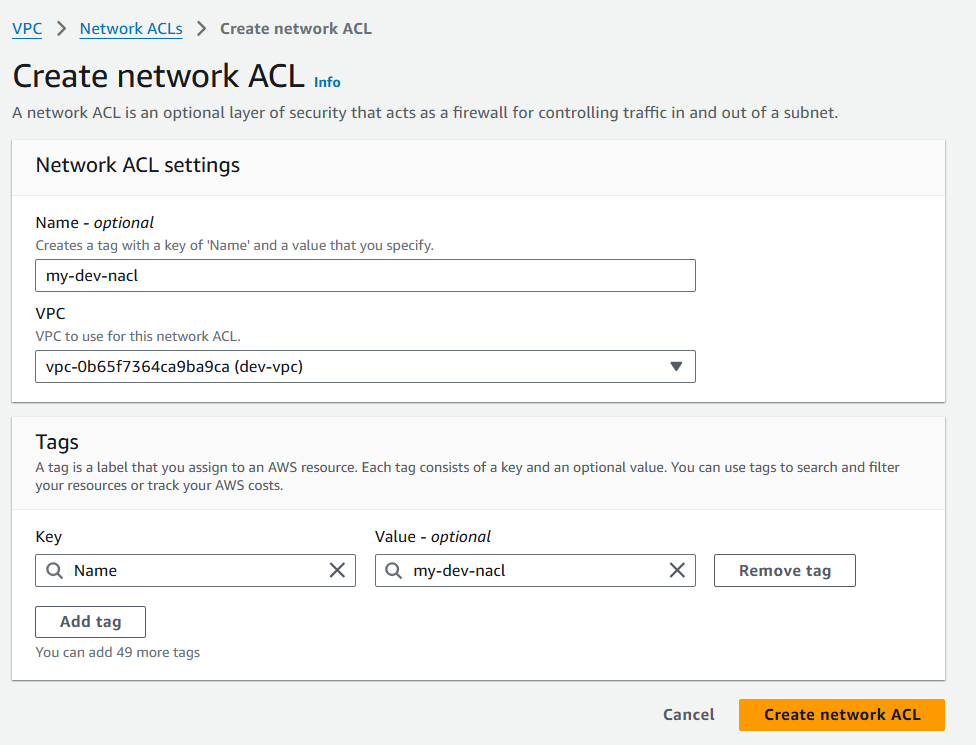**

**open vpc >network nacl >eadit Go to network nacl  edit inbound rules gave http(80), custom tcp(443) allow Anay ware**
**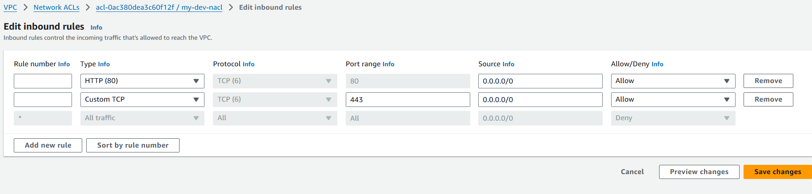**

**now we have to launch an ec2 instance >go to ec2 Dashboard Open the EC2 Dashboard in the AWS Management Console Choose an (AMI), such as the latest Amazon Linux 2 .Select an Instance Type, such as t2.micro,"Next: Configure Instance Details".Create a new Security Group, or choose an existing one. Add rules like:SSH (port 22) for access to Linux instances.HTTP (port 80) for web traffic.HTTPS (port 443) for secure web traffic. in advance details**

2. **Install a Simple Web Server:**
   ```bash
   sudo yum update -y
   sudo yum install -y httpd
   ```

3. **Start the Web Server:**
   ```bash
   sudo systemctl start httpd
   sudo systemctl enable httpd
   ```

4. **Create a Simple HTML Page:**
   ```bash
   echo "<html><h1>Welcome to My VPC Web App </h1></html>" | sudo tee /var/www/html/index.html**
**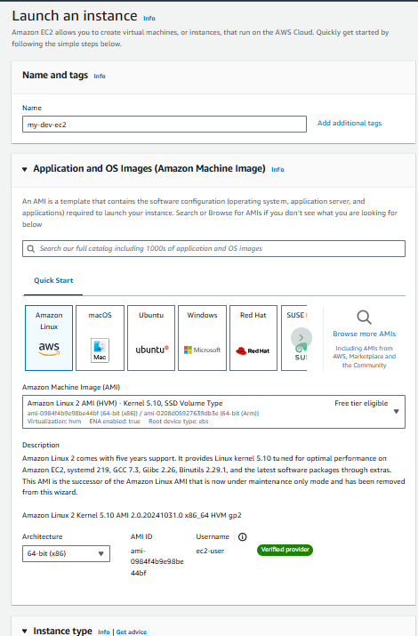 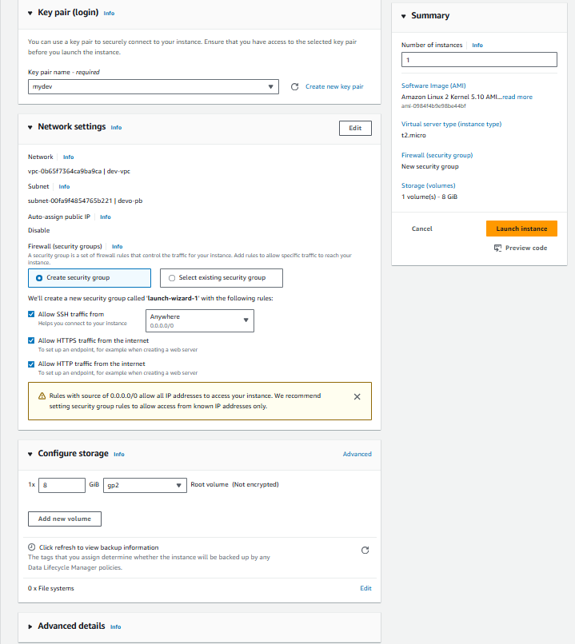      Click "Launch Instance" to start the instance**

**You've successfully created a real-time web application within a VPC, utilizing subnets, route tables, an Internet Gateway, and Network ACLs. This setup provides a solid understanding of AWS networking components and how they work together**


